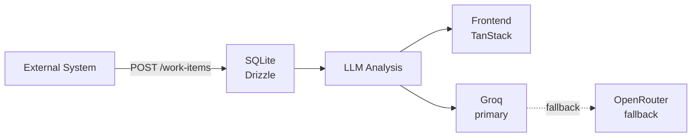
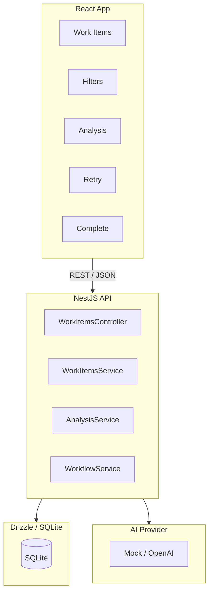

# AGENTS.md


## Commands

All scripts run from `backend/` directory unless noted otherwise.

```bash
# Install dependencies (from repo root)
cd backend && pnpm install
cd frontend && pnpm install


# Docker dev (recommended, from infra/)
docker compose watch

# Tests
cd backend && pnpm run test           # vitest run
cd backend && pnpm run test:coverage  # vitest with coverage
cd backend && npx vitest run tests/work-items.e2e.spec.ts  # single file

# Lint + type check
cd backend && pnpm run lint    # eslint + tsc --noEmit
cd frontend && pnpm run lint   # eslint + tsc --noEmit

# Format
cd backend && pnpm run format   # prettier --write
cd frontend && pnpm run format  # prettier --write

# DB migrations (inside backend container)
npx drizzle-kit generate
npx drizzle-kit migrate
```

## Architecture

AI-assisted work intake system. Data flows:





**Backend** (`backend/src/`):

- `work-items/` — module with controller, service, DTOs (Zod + nestjs-zod)
- `ai/` — LLM provider abstraction with Groq primary, OpenRouter fallback
- `db/` — Drizzle schema + better-sqlite3 setup via @knaadh/nestjs-drizzle-better-sqlite3
- `common/` — filters, interceptors, state-machine constants

**Frontend** (`frontend/src`):

- `routes/` — TanStack Router routes (code-based for single-page, file-based if expanded)
- `api/` — axios client + TanStack Query hooks
- `components/` — WorkItemCard, StatusBadge, FilterBar
- `store/` — Zustand store for UI-only state (filter selection)

**Infra** (`infra/`):

`docker-compose.yml` — backend + frontend with watch mode
`.env.example` — GROQ_API_KEY, OPENROUTER_API_KEY, DATABASE_PATH

## Stack

**Frontend**

- React
- TypeScript
- React Compiler
- Vite
- Tanstack Router
- Redux Toolkit
- Tailwind CSS
- Zod


**Backend**

- NestJS
- TypeScript
- Drizzle
- SQLite
- Zod + nestjs-zod
- AI provider abstraction


**AI**

- Grok AI with llama-3.1-8b-instant (fast)
- OpenRouter with meta-llama/llama-3.3-70b-instruct (quality fallback)


Testing

- Jest
- Vitest
- React Testing Library
- supertest

Dev

- Docker
- Oxlint
- Prettier

## Key Config

`.env` needs: `GROQ_API_KEY`, `OPENROUTER_API_KEY`, `DATABASE_PATH=./data/app.db`, `PORT=3000`

Frontend proxies `/api` to backend via Vite config.


## Backend: Drizzle + SQLite Setup

Install the required packages:

```bash
pnpm install @knaadh/nestjs-drizzle-better-sqlite3 drizzle-orm better-sqlite3
pnpm install -D @types/better-sqlite3 drizzle-kit
```

## Backend: LLM Fallback Strategy

Do not depend on an external package. Implement a lightweight provider cascade yourself, directly reflecting the assessment's fault-tolerance requirements:

```ts
// ai/llm.service.ts
import { Injectable, Logger } from '@nestjs/common';

@Injectable()
export class LlmService {
  private readonly logger = new Logger(LlmService.name);

  async analyze(workItem: WorkItem): Promise<AnalysisResult> {
    const providers = [
      { name: 'groq', call: () => this.callGroq(workItem) },
      { name: 'openrouter', call: () => this.callOpenRouter(workItem) },
    ];

    for (const provider of providers) {
      try {
        return await this.withTimeout(provider.call(), 30_000);
      } catch (err) {
        this.logger.warn(`${provider.name} failed: ${err.message}`);
        continue;
      }
    }
    throw new Error('All LLM providers failed');
  }

  private withTimeout<T>(promise: Promise<T>, ms: number): Promise<T> {
    return Promise.race([
      promise,
      new Promise<T>((_, reject) =>
        setTimeout(() => reject(new Error('LLM timeout')), ms),
      ),
    ]);
  }
}
```

Groq uses llama-3.1-8b-instant (fast), OpenRouter uses meta-llama/llama-3.3-70b-instruct as a quality fallback. Both APIs are OpenAI-compatible, so the request-building code can be shared.

Additionally, validate the LLM's response with Zod before persisting. If parsing fails, treat it as a provider failure and continue the cascade:

```ts
const AnalysisSchema = z.object({
  category: z.string(),
  priority: z.enum(['LOW', 'MEDIUM', 'HIGH']),
  summary: z.string(),
  recommendedAction: z.string(),
});

const parsed = AnalysisSchema.safeParse(rawOutput);
if (!parsed.success) throw new Error('Malformed LLM output');
```
## Backend: Zod + nestjs-zod Validation

## Backend: State Machine

Define allowed transitions as a whitelist map in `common/state-machine.ts`:

```ts
export const ALLOWED_TRANSITIONS: Record<WorkItemStatus, WorkItemStatus[]> = {
  RECEIVED: ['ANALYSING'],
  ANALYSING: ['READY_FOR_REVIEW', 'FAILED'],
  READY_FOR_REVIEW: ['COMPLETED'],
  COMPLETED: [],
  FAILED: [],
};
```

When `PATCH /work-items/:id/status` receives a request, verify `ALLOWED_TRANSITIONS[current].includes(next)` before updating. Illegal transitions return `409 Conflict`.


The `retry` endpoint is a special case: only work items with status `FAILED` are eligible. On retry, set status back to `ANALYSING` and re-run analysis.
