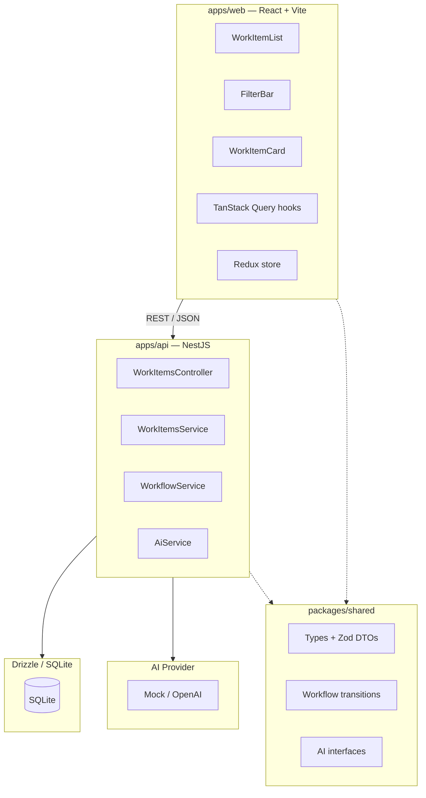

# AGENTS.md

## Commands

```bash
# Install dependencies (from repo root)
pnpm install

# Tests
cd apps/api && pnpm run test:e2e

# Lint
cd apps/api && pnpm run lint
cd apps/web && pnpm run lint

# Build
cd apps/api && pnpm run build
cd apps/web && pnpm run build

# DB migrations
cd apps/api && pnpm run db:generate
cd apps/api && pnpm run db:migrate

# Dev (both api + web)
pnpm run dev
```

## Architecture

AI-assisted work intake system — monorepo with shared types.

```
odin_project/
├── packages/
│   └── shared/          # @odin/shared — types, Zod DTOs, workflow, AI interfaces
├── apps/
│   ├── api/             # NestJS backend (Drizzle + SQLite + AI provider)
│   └── web/             # React + Vite frontend (TanStack Router + Query + Redux)
├── docs/adr/            # Architecture Decision Records
└── infra/               # Docker compose
```



**`packages/shared/` (`@odin/shared`)** — single source of truth:

- `types/work-item.ts` — `WorkItemStatus`, `WorkItemPriority`, `WorkItem`
- `dto/create-work-item.ts` — `CreateWorkItemSchema` (Zod) + `CreateWorkItemRequest` (type)
- `dto/update-status.ts` — `UpdateStatusSchema` (Zod) + `UpdateStatusRequest` (type)
- `workflow/transitions.ts` — `ALLOWED_TRANSITIONS` whitelist map
- `ai/types.ts` — `AiAnalysis`, `AiProvider` interfaces
- `ai/analysis-schema.ts` — `AiAnalysisSchema` (Zod) + `AiAnalysisDto` (type)

**`apps/api/`** — NestJS backend:

- `work-items/` — controller, service, module with workflow validation
- `ai/` — `AiProvider` interface with `MockAiProvider` and `OpenAiProvider`
- `db/` — Drizzle schema + custom `better-sqlite3` provider (~20 lines, no community wrapper)
- `common/` — `ZodValidationPipe`, `HttpExceptionFilter`, `LoggingInterceptor`

**`apps/web/`** — React frontend:

- `components/` — `WorkItemCard`, `StatusBadge`, `FilterBar`, `WorkItemList`
- `hooks/use-work-items.ts` — TanStack Query hooks
- `store/` — Redux Toolkit store with `filterSlice`
- `lib/api.ts` — axios client
- `types/work-item.ts` — re-exports from `@odin/shared`

## Stack

**Frontend**

- React 19
- TypeScript 6
- React Compiler (babel plugin)
- Vite 8
- TanStack Router + Query
- Redux Toolkit
- Tailwind CSS v4
- Zod 4

**Backend**

- NestJS 12
- TypeScript 6 (nodenext resolution)
- Drizzle ORM + better-sqlite3 (direct, no community wrapper)
- Zod 4 (custom ZodValidationPipe, no nestjs-zod)
- AI provider abstraction (Mock + OpenAI)

**Shared**

- `@odin/shared` workspace package
- Zod 4 schemas + inferred types
- Pure domain logic (workflow transitions)

**Testing**

- Vitest
- supertest (e2e)

**Dev**

- pnpm workspace
- Oxlint
- Prettier

## Key Config

`apps/api/.env` needs: `OPENAI_API_KEY` (optional), `AI_PROVIDER=mock|openai`, `DATABASE_URL=./data/odin.db`, `PORT=3000`

Frontend proxies `/work-items` to backend via Vite config.

## Backend: State Machine

Defined in `packages/shared/src/workflow/transitions.ts`:

```ts
export const ALLOWED_TRANSITIONS: Record<WorkItemStatus, WorkItemStatus[]> = {
  RECEIVED: ['ANALYSING'],
  ANALYSING: ['READY_FOR_REVIEW', 'FAILED'],
  READY_FOR_REVIEW: ['COMPLETED'],
  COMPLETED: [],
  FAILED: ['ANALYSING'], // only via retry
};
```

`WorkflowService` (in `apps/api`) validates transitions and throws `409 Conflict` on invalid ones.

## Backend: AI Provider

Single provider selected via `AI_PROVIDER` env var. Both implement `AiProvider` from `@odin/shared`:

```ts
export interface AiProvider {
  analyse(input: { title: string; description: string }): Promise<AiAnalysis>;
}
```

- `MockAiProvider` — returns deterministic results after 100ms delay
- `OpenAiProvider` — calls OpenAI chat completions API

`AiService` validates responses with `AiAnalysisSchema` (Zod). Malformed output is treated as a failure — work item transitions to `FAILED`.

## Backend: Idempotent Creation

`POST /work-items` is idempotent on `externalId`:
1. Fast path: SELECT by `externalId` — return existing if found
2. INSERT with UNIQUE constraint as final guard against race conditions
3. On UNIQUE constraint violation, SELECT again to retrieve the concurrently-inserted row