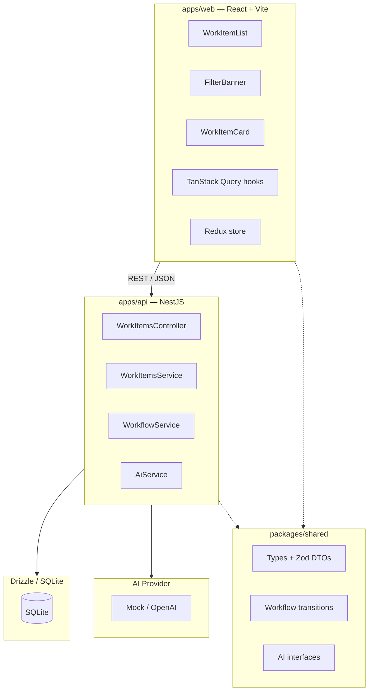

# AGENTS.md

## Commands

```bash
# Install dependencies (from repo root)
pnpm install

# Tests
cd apps/api && pnpm run test:e2e

# Lint
cd apps/api && pnpm run lint
cd apps/web && pnpm run lint

# Build
cd apps/api && pnpm run build
cd apps/web && pnpm run build

# DB migrations
cd apps/api && pnpm run db:generate
cd apps/api && pnpm run db:migrate

# Dev (both api + web)
pnpm run dev
```

## Architecture

AI-assisted work intake system — monorepo with shared types.

```
odin_project/
├── packages/
│   └── shared/          # @odin/shared — types, Zod DTOs, workflow, AI interfaces
├── apps/
│   ├── api/             # NestJS backend (Drizzle + SQLite + AI provider)
│   └── web/             # React + Vite frontend (TanStack Router + Query + Redux)
├── docs/adr/            # Architecture Decision Records
└── infra/               # Docker compose
```



**`packages/shared/` (`@odin/shared`)** — single source of truth:

- `types/work-item.ts` — `WorkItemStatus`, `WorkItemPriority`, `WorkItem`
- `dto/create-work-item.ts` — `CreateWorkItemSchema` (Zod) + `CreateWorkItemRequest` (type)
- `dto/update-status.ts` — `UpdateStatusSchema` (Zod) + `UpdateStatusRequest` (type)
- `workflow/transitions.ts` — `ALLOWED_TRANSITIONS` whitelist map
- `ai/types.ts` — `AiAnalysis`, `AiProvider` interfaces
- `ai/analysis-schema.ts` — `AiAnalysisSchema` (Zod) + `AiAnalysisDto` (type)

**`apps/api/`** — NestJS backend:

- `work-items/` — controller, service, module with workflow validation
- `ai/` — provider registry + factory pattern, `AiProvider` interface, `GroqProvider` (groq-sdk), `OpenAiProvider`, `MockAiProvider`
- `ai/providers/provider.registry.ts` — extensible registry; adding a new LLM = 1 entry
- `db/` — Drizzle schema + custom `better-sqlite3` provider (~20 lines, no community wrapper)
- `common/` — `ZodValidationPipe`, `HttpExceptionFilter`, `LoggingInterceptor`
- `config/` — typed configuration via `@nestjs/config` (`app.config.ts`)

**`apps/web/`** — React frontend:

- `components/` — `WorkItemCard`, `StatusBadge`, `FilterBanner`, `WorkItemList`
- `hooks/use-work-items.ts` — TanStack Query hooks
- `store/` — Redux Toolkit store with `filterSlice`
- `lib/api.ts` — axios client
- `types/work-item.ts` — re-exports from `@odin/shared`

## Stack

**Frontend**

- React 19
- TypeScript 6
- React Compiler (babel plugin)
- Vite 8
- TanStack Router + Query
- Redux Toolkit
- Tailwind CSS v4
- Zod 4

**Backend**

- NestJS 12
- TypeScript 6 (nodenext resolution)
- Drizzle ORM + better-sqlite3 (direct, no community wrapper)
- @nestjs/config (typed configuration)
- Zod 4 (custom ZodValidationPipe, no nestjs-zod)
- AI provider abstraction (Mock + Groq + OpenAI) with provider registry + factory pattern
- groq-sdk (official Groq SDK)
- Scalar API reference (`/reference`)

**Shared**

- `@odin/shared` workspace package
- Zod 4 schemas + inferred types
- Pure domain logic (workflow transitions)

**Testing**

- Vitest
- supertest (e2e)

**Dev**

- pnpm workspace
- Oxlint
- Prettier

## Key Config

`apps/api/.env`:

```env
# Database
DATABASE_URL=./data/odin.db
PORT=3000

# Groq AI (auto-enabled when API key is set)
GROQ_API_KEY=gsk_xxx
GROQ_MODELS=qwen/qwen3.8-27b,openai/gpt-oss-20b

# OpenAI AI (auto-enabled when API key is set)
OPENAI_API_KEY=sk-xxx
OPENAI_MODELS=gpt-4o-mini,gpt-4o
```

All env vars are loaded via `@nestjs/config` (`ConfigModule.forRoot` in `AppModule`).
Each provider is only available if its `*_API_KEY` is set. Mock is always available.

Frontend proxies `/work-items` to backend via Vite config.

## Backend: State Machine

Defined in `packages/shared/src/workflow/transitions.ts`:

```ts
export const ALLOWED_TRANSITIONS: Record<WorkItemStatus, WorkItemStatus[]> = {
  RECEIVED: ['ANALYSING'],
  ANALYSING: ['READY_FOR_REVIEW', 'FAILED'],
  READY_FOR_REVIEW: ['COMPLETED'],
  COMPLETED: [],
  FAILED: ['ANALYSING'], // only via retry
};
```

`WorkflowService` (in `apps/api`) validates transitions and throws `409 Conflict` on invalid ones.

## Backend: AI Provider

Provider switchable at runtime via UI dropdown or `PUT /ai-config`.
Architecture uses a **provider registry + factory pattern** (`provider.registry.ts`).

```ts
export interface AiProvider {
  analyse(input: { title: string; description: string }): Promise<AiAnalysis>;
}
```

- `MockAiProvider` — deterministic results, always available, no API key needed
- `GroqProvider` — uses `groq-sdk`, supports any Groq-hosted model (`GROQ_MODELS`)
- `OpenAiProvider` — uses OpenAI chat completions API, supports any OpenAI model (`OPENAI_MODELS`)

`AiService` validates responses with `AiAnalysisSchema` (Zod). Malformed output → `FAILED`.

### Adding a new provider

1. Implement `AiProvider` in `src/ai/providers/`
2. Add config fields to `src/config/app.config.ts`
3. Add entry to `buildProviderDefinitions()` in `src/ai/providers/provider.registry.ts`

The UI dropdown populates automatically — no frontend changes needed.

## Backend: AI Config

```bash
# GET — returns selected provider + all available options
curl http://localhost:3000/ai-config
# → { "selected": "groq:llama-3.1-8b-instant",
#     "available": [
#       { "id": "mock", "name": "Mock AI", "provider": "mock", "model": "mock" },
#       { "id": "groq:llama-3.1-8b-instant", "name": "Groq - Llama 3.1 8B Instant",
#         "provider": "groq", "model": "llama-3.1-8b-instant" }
#     ] }

# PUT — switch provider by id (any value from available[])
curl -X PUT http://localhost:3000/ai-config \
  -H "Content-Type: application/json" \
  -d '{"provider":"openai:gpt-4o-mini"}'
```

## Backend: Idempotent Creation

`POST /work-items` is idempotent on `externalId`:
1. Fast path: SELECT by `externalId` — return existing if found
2. INSERT with UNIQUE constraint as final guard against race conditions
3. On UNIQUE constraint violation, SELECT again to retrieve the concurrently-inserted row
