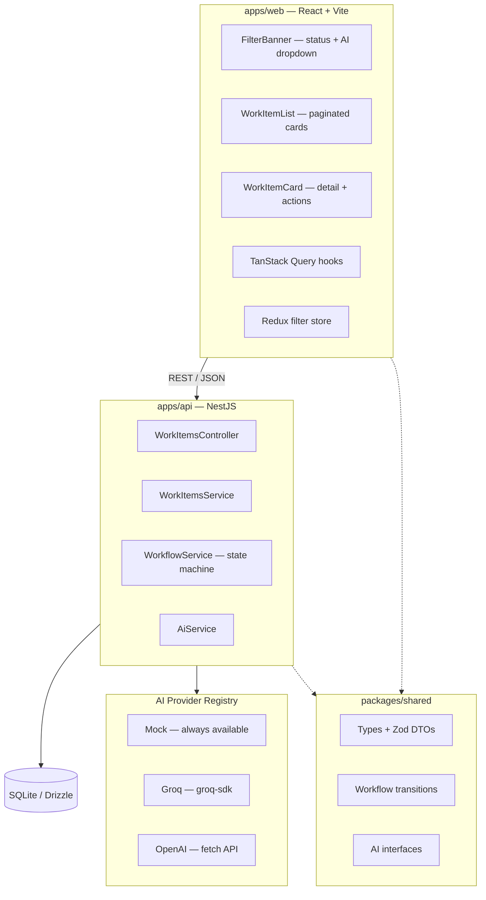
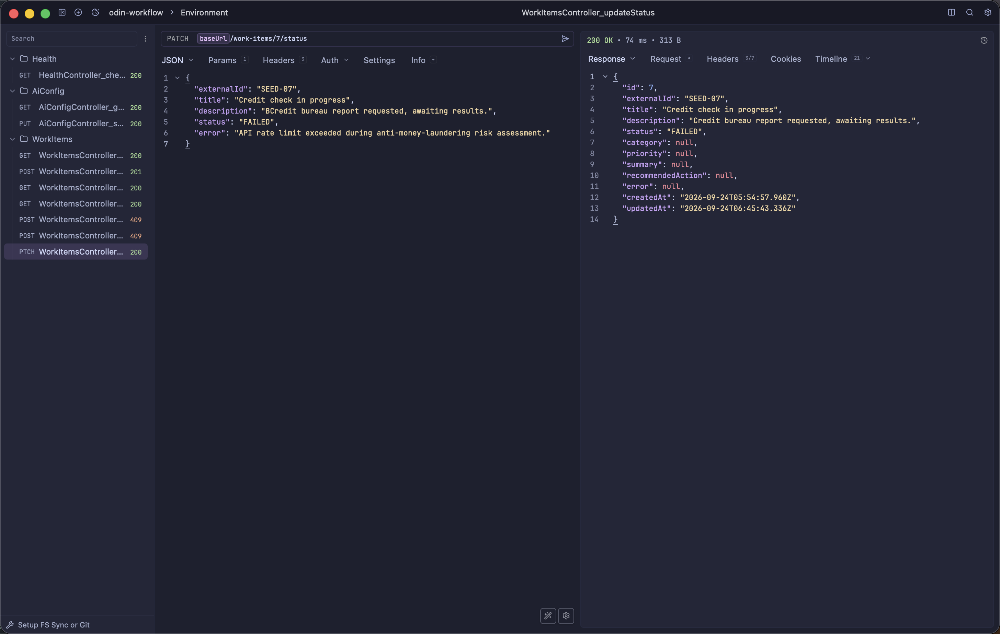

# Odin — AI-Assisted Work Intake System

Monorepo for an AI-assisted work intake system. External systems submit work items via REST API; an LLM provider analyses each item (categorisation, priority, summary, recommended action); operations users review and complete items through the web dashboard.

---

## Setup

### Prerequisites

- **Node.js** ≥ 24 (ESM, TypeScript 6)
- **pnpm** ≥ 11

### Install & Run

```bash
# Clone and install
git clone <repo-url> && cd odin_project
pnpm install

# Start both API and web dashboard
pnpm run dev
```

| Service | URL |
|---------|-----|
| Web dashboard | http://localhost:5173 |
| API | http://localhost:3000 |
| API reference (Scalar) | http://localhost:5173/reference |

### Environment

Copy and edit `apps/api/.env`:

```env
NODE_ENV=development
PORT=3000
DATABASE_URL=./data/odin.db

# Groq AI (auto-enabled when key is set)
GROQ_API_KEY=gsk_xxx
GROQ_MODELS=openai/gpt-oss-20b,qwen/qwen3.8-27b

# OpenAI (auto-enabled when key is set)
# OPENAI_API_KEY=sk-xxx
# OPENAI_MODELS=gpt-4o-mini
```

Each provider is only available if its `*_API_KEY` is set. Mock is always available as a fallback. Switch providers at runtime via the dropdown in the web dashboard or `PUT /ai-config`.

### Docker

**Development** (hot reload — bind-mounts `src/` + `apps/api/data`; nest `--watch` + vite HMR):

```bash
docker compose up --build          # auto-merges compose.yml + compose.override.yml
```

Web on http://localhost:5173, API on http://localhost:3000. The dev API shares `./apps/api/data` with bare-metal dev (same SQLite file) — run only one API at a time.

**Production** (override ignored; nginx-served build + compiled API):

```bash
docker compose -f compose.yml up -d --build
```

Web on http://localhost:8080, API on http://localhost:3000, SQLite persisted in the named volume `odin-data`. AI keys (optional): `GROQ_API_KEY=... OPENAI_API_KEY=... docker compose -f compose.yml up`.

---

## Architecture

```
odin_project/
├── packages/shared/       # @odin/shared — types, DTOs, workflow, AI interfaces
├── apps/
│   ├── api/               # NestJS backend (Drizzle + SQLite + AI providers)
│   └── web/               # React + Vite frontend (TanStack Router + Query + Redux)
├── docs/adr/              # Architecture Decision Records
└── infra/                 # Docker compose
```



### State Machine

Work items progress through a defined state machine:

```
RECEIVED → ANALYSING → READY_FOR_REVIEW → COMPLETED
                ↘ FAILED ↗ (retry)
```

Transitions are validated server-side in `WorkflowService`. Invalid transitions return `409 Conflict`.

### AI Provider Registry

Providers are registered via an extensible factory pattern in `src/ai/providers/provider.registry.ts`. Each provider type maps to a factory function, enabled by its API key. Models are configured per-provider via comma-separated env vars.

Adding a new provider (e.g., Anthropic):
1. Implement the `AiProvider` interface
2. Add a factory entry to the registry
3. Add config fields to `app.config.ts`

The UI dropdown populates dynamically — no frontend changes needed.

See [ADR-003](docs/adr/03-ai-llm-integration.md) for the full design.

---

## API Reference

Interactive docs at `/reference` when the server is running.

### Work Items

| Method | Path | Description |
|--------|------|-------------|
| `POST` | `/work-items` | Submit a work item (idempotent on `externalId`) |
| `GET` | `/work-items` | List work items (cursor-paginated, newest first) |
| `GET` | `/work-items/stats` | Aggregate per-status counts |
| `GET` | `/work-items/:id` | Get a single work item |
| `POST` | `/work-items/:id/analyse` | Trigger AI analysis (`RECEIVED` → `ANALYSING`) |
| `POST` | `/work-items/:id/retry` | Retry a failed analysis (`FAILED` → `RECEIVED`) |
| `PATCH` | `/work-items/:id/status` | Manual status transition (validated) |

### AI Config

| Method | Path | Description |
|--------|------|-------------|
| `GET` | `/ai-config` | Get current provider + all available |
| `PUT` | `/ai-config` | Switch provider by id |

```bash
# List available providers
curl http://localhost:3000/ai-config
# → { "selected": "groq:openai/gpt-oss-20b",
#     "available": [{ "id": "mock", "name": "Mock AI", ... }, ...] }

# Switch provider
curl -X PUT http://localhost:3000/ai-config \
  -H "Content-Type: application/json" \
  -d '{"provider":"groq:qwen/qwen3.8-27b"}'
```

---

## Assumptions

1. **Single-tenant, single-user** — no authentication, no multi-tenancy. Work items belong to one logical workspace.
2. **Synchronous AI analysis** — analysis runs inline (sub-30s timeout). No background job queue.
3. **SQLite is sufficient** — read/write volume fits in a single-node SQLite. No concurrent write contention beyond idempotency.
4. **Work items are text-only** — no file uploads, no binary attachments. Title + description are the only inputs to the LLM.
5. **External ID uniqueness** — the `externalId` field is the integration contract. Upstream systems must provide stable, unique IDs.
6. **No soft-delete** — items are never deleted, only transitioned through statuses.

---

## Technical Decisions

### 1. Provider Registry + Factory Pattern (over single env-var switch)

**Decision:** Each AI provider registers a factory function in a typed registry. Models are parsed from env vars into arrays, creating one selectable entry per model.

**Why:**
- Adding a new provider is three files (provider class, registry entry, config field)
- The UI dropdown renders dynamically — no hardcoded provider lists
- Per-model selection (not just per-provider) gives operators precise control
- The `AiProvider` interface keeps providers swappable at runtime

**Rejected:** A single `AI_PROVIDER=mock|groq|openai` env var with hardcoded model lists in the frontend. Too rigid, doesn't support multiple models per provider.

### 2. Direct Drizzle + better-sqlite3 (over community NestJS wrapper)

**Decision:** A ~20-line custom provider creates a Drizzle instance directly from `better-sqlite3`.

**Why:**
- Drizzle ORM natively supports `better-sqlite3`
- The community wrapper is unmaintained and adds an external dependency
- Direct integration makes the database setup transparent to reviewers

---

## Production Considerations

### Authentication & Authorization
- Add JWT-based auth with role-scoped endpoints (submitter vs. reviewer)
- API keys for machine-to-machine submission from external systems
- Rate limiting per client

### Background Processing
- Replace synchronous AI analysis with a job queue (BullMQ + Redis)
- Retry with exponential backoff for transient LLM failures
- Dead-letter queue for permanently failed items

### Observability
- Structured JSON logging (Pino) with correlation IDs per request
- OpenTelemetry tracing across API → AI provider calls
- Metrics: analysis latency p50/p95/p99, failure rate by provider/model, queue depth

### Scalability
- Swap SQLite for PostgreSQL with connection pooling
- Horizontal scaling: stateless API instances behind a load balancer
- Read replicas for the dashboard query load

### Security
- Validate and sanitise all LLM inputs (prompt injection)
- Store API keys in a secrets manager (not `.env` files)
- HTTPS everywhere, CSP headers, CORS whitelist
- Input size limits on work item title/description

### Database Design
- Add indexes on `status`, `created_at` for filtered queries
- Consider partitioning by `created_at` for archival
- Database-level migrations with rollback support

### LLM Reliability & Cost
- Per-model cost tracking and budgets
- Response caching for identical inputs
- Fallback to cheaper model on rate-limit (`qwen` → `llama`)
- Prompt versioning and A/B testing

---

## AI Usage

**Tools used:** Deepseek (via [pi coding agent](https://github.com/earendil-works/pi) ) for planning, code generation, refactoring, and documentation.

**What AI was used for:**
- Designing the frontend ui and redundant functionality like query hooks, redux store, and filter banner
- Designing the provider registry + factory pattern
- Refactoring from raw `fetch` to `groq-sdk`
- Migrating from `dotenv` to `@nestjs/config`
- Generating drizzle migrations
- Writing ADRs and README documentation

**Verification:**
- All generated code passes `pnpm run build` (TypeScript strict mode)
- 19 e2e tests pass with in-memory SQLite
- API endpoints verified via curl
- Frontend builds verify type compatibility with shared package

**Changes made to AI-generated code:**
- updating the POST endpoint to create work-items to be idempotent on `externalId` (upsert)
- updating the AI provider registry to support multiple models per provider and dynamic dropdown population.
- Adding a `WorkflowService` to validate state transitions and return `409 Conflict` on invalid transitions.

---

## Checklist

Tested the endpoints manually via curl and yaak too.



## Scripts

```bash
# From repo root
pnpm install              # Install all dependencies
pnpm run dev              # Start api + web in dev mode
pnpm run build            # Build both
pnpm run test:e2e         # Run e2e tests (api)

# Database
cd apps/api
pnpm run db:generate      # Generate drizzle migration
pnpm run db:migrate       # Apply migrations
pnpm run db:studio        # Open drizzle-kit studio (SQLite browser)
```
