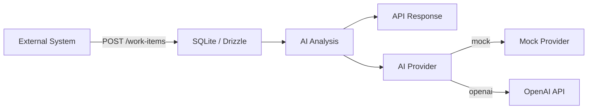

# Odin — AI-Assisted Work Intake System

## Overview

Odin is an AI-assisted work intake system that receives work items from external systems, analyses them using an LLM, and manages their lifecycle through a defined state machine.

## Architecture



```
Controller  →  Service  →  Database (Drizzle / SQLite)
                ↓
          WorkflowService (state machine)
                ↓
          AiService → AiProvider (mock | openai)
```

## Tech Stack

| Layer       | Technology                       |
|-------------|----------------------------------|
| Runtime     | Node.js 22+                      |
| Framework   | NestJS 12                        |
| Language    | TypeScript 6                     |
| Database    | SQLite via better-sqlite3        |
| ORM         | Drizzle ORM                      |
| Validation  | Zod 4                            |
| Testing     | Vitest + Supertest               |
| Linting     | Oxlint                           |
| Formatting  | Prettier                         |

## Getting Started

### Prerequisites

- Node.js 22 LTS or newer
- npm

### Installation

```bash
cd backend
npm install
```

### Environment

Copy the example environment file and adjust as needed:

```bash
cp .env.example .env
```

### Running

```bash
# Development (with hot reload)
npm run start:dev

# Production build
npm run build
npm run start:prod
```

The server starts on `http://localhost:3000` by default.

## Environment Variables

| Variable         | Description                          | Default           |
|------------------|--------------------------------------|-------------------|
| `NODE_ENV`       | Environment mode                     | `development`     |
| `PORT`           | Server port                          | `3000`            |
| `DATABASE_URL`   | SQLite database file path            | `./data/odin.db`  |
| `AI_PROVIDER`    | AI provider: `mock` or `openai`      | `mock`            |
| `OPENAI_API_KEY` | OpenAI API key (when using `openai`) | —                 |
| `OPENAI_MODEL`   | OpenAI model name                    | `gpt-4o-mini`     |

## Database & Migrations

```bash
# Generate migration from schema changes
npm run db:generate

# Apply migrations
npm run db:migrate
```

The database file is at `data/odin.db` and is gitignored.

## API Endpoints

| Method | Path                      | Description                          |
|--------|---------------------------|--------------------------------------|
| POST   | `/work-items`             | Create a new work item (idempotent)  |
| GET    | `/work-items`             | List all work items                  |
| GET    | `/work-items?status=X`    | Filter by status                     |
| GET    | `/work-items/:id`         | Get a single work item               |
| POST   | `/work-items/:id/analyse` | Trigger AI analysis                  |
| POST   | `/work-items/:id/retry`   | Retry a failed work item             |
| PATCH  | `/work-items/:id/status`  | Update work item status              |

### Create Work Item

```http
POST /work-items
Content-Type: application/json

{
  "externalId": "CRM-12345",
  "title": "Missing income document",
  "description": "The applicant submitted their application but has not provided their latest payslip."
}
```

## Workflow

```
RECEIVED
    ↓   POST /:id/analyse
ANALYSING
   ↙          ↘
READY_FOR_REVIEW   FAILED
   ↓                 ↓  POST /:id/retry
COMPLETED        ANALYSING
```

### Allowed Transitions

- `RECEIVED` → `ANALYSING` (via analyse endpoint)
- `ANALYSING` → `READY_FOR_REVIEW` (successful analysis)
- `ANALYSING` → `FAILED` (failed analysis)
- `READY_FOR_REVIEW` → `COMPLETED` (manual completion)
- `FAILED` → `ANALYSING` (via retry endpoint)

### Invalid Transitions (rejected with 409)

- `COMPLETED` → anything
- `RECEIVED` → `COMPLETED`
- `READY_FOR_REVIEW` → `FAILED` or `ANALYSING`

## AI Architecture

The AI layer follows a simple provider pattern:

```
A iService ──→ AiProvider (interface)
                   ↙
          ┌────────┴────────┐
          ↓                  ↓
    MockAiProvider    OpenAiProvider
```

- **`MockAiProvider`** — returns deterministic mock results for development and testing
- **`OpenAiProvider`** — calls the OpenAI API with a structured prompt

The provider is selected via the `AI_PROVIDER` environment variable. Adding a new provider requires only implementing the `AiProvider` interface.

### AI Response Validation

Every AI response is validated against a Zod schema before being persisted:

```ts
AiAnalysisSchema = z.object({
  category: z.string().min(1),
  priority: z.enum(['LOW', 'MEDIUM', 'HIGH']),
  summary: z.string().min(1),
  recommendedAction: z.string().min(1),
});
```

Malformed AI responses cause the work item to transition to `FAILED` with a safe error message. No invalid data is persisted.

### Timeout

AI requests have a 30-second timeout. Timeouts cause the work item to transition to `FAILED`.

## Error Handling

All errors return a consistent JSON structure:

```json
{
  "statusCode": 409,
  "code": "INVALID_WORKFLOW_TRANSITION",
  "message": "Cannot transition work item from COMPLETED to ANALYSING.",
  "timestamp": "2026-01-01T00:00:00.000Z",
  "path": "/work-items/1/status"
}
```

Error codes:
- `VALIDATION_ERROR` — request validation failure
- `INVALID_WORKFLOW_TRANSITION` — disallowed status change
- `ANALYSIS_NOT_ALLOWED` — item not eligible for analysis
- `RETRY_NOT_ALLOWED` — item not eligible for retry
- `INTERNAL_ERROR` — unexpected server error

Internal errors never expose stack traces, API keys, or provider internals.

## Concurrency / Idempotency

`POST /work-items` is idempotent by `externalId`. The `external_id` column has a database-level `UNIQUE` constraint ensuring that even concurrent requests with the same ID will only create one record. The second request returns the existing resource rather than an error.

## Testing

```bash
# Unit tests
npm test

# E2E tests
npm run test:e2e

# Watch mode
npm run test:watch
```

Tests use in-memory SQLite databases for isolation. No external AI APIs are called during tests — the mock provider is used exclusively.

### Test Coverage

| Test | Coverage |
|------|----------|
| Duplicate externalId | Idempotent creation, only one DB record |
| Invalid workflow transition | COMPLETED → ANALYSING rejected (409) |
| Malformed AI response | Work item → FAILED, bad data not persisted |
| AI timeout | Work item → FAILED with timeout message |
| AI provider error | Work item → FAILED with error message |
| Valid analysis | RECEIVED → READY_FOR_REVIEW with analysis data |
| READY_FOR_REVIEW → COMPLETED | Valid transition |
| RECEIVED → COMPLETED | Rejected (409) |
| Status filtering | Query by status works correctly |
| Retry non-FAILED | Rejected (409) |
| Retry FAILED | Successful re-analysis |

## Technical Decisions

### 1. Direct Drizzle integration (no community NestJS wrapper)

Drizzle ORM supports `better-sqlite3` natively. Using the community package `@knaadh/nestjs-drizzle-better-sqlite3` would add an external dependency that's been unmaintained for ~2 years. Instead, a small custom provider (`database.provider.ts`) creates the Drizzle instance and exposes it through NestJS DI. This is ~20 lines of code and removes a dependency.

### 2. Single provider selection (no cascading fallback)

Instead of a Groq → OpenRouter cascade, the provider is selected via `AI_PROVIDER` env var. This avoids:

- Duplicate API calls and costs
- Inconsistent outputs between providers
- Hard-to-debug fallback chains
- Unnecessary complexity for an assessment

Adding a new provider requires implementing `AiProvider` — the architecture is open for extension.

### 3. Workflow logic in its own service

The state machine is not scattered across controllers or the main service. `WorkflowService` owns `ALLOWED_TRANSITIONS` and provides explicit methods (`validateTransition`, `validateRetry`, `validateCanAnalyse`). This keeps the domain logic testable and prevents accidental bypass of transition rules.

## Assumptions

- SQLite is sufficient for the assessment scope (single-instance, low volume)
- No authentication is required in this phase
- Mock AI provider is acceptable for development/testing
- Work items are created by an external system (no UI for creation)
- `externalId` uniqueness is enforced at the database level for concurrency safety

## Production Considerations

For a production deployment, the following would be added:

- **Authentication / authorization** — JWT or API key-based auth
- **PostgreSQL** — replace SQLite for concurrent writes and scalability
- **Background job queue** (e.g. BullMQ / Azure Service Bus) — for async AI processing
- **LLM rate limiting** — prevent API quota exhaustion
- **LLM retry with exponential backoff** — handle transient provider failures
- **Observability** — OpenTelemetry tracing, structured logging, metrics
- **Audit logging** — track who changed what and when
- **Secret management** — use a vault or cloud secret manager
- **RBAC** — role-based access for different user types
- **PII protection** — redact sensitive data from logs and AI prompts
- **AI cost monitoring** — track token usage and costs per work item
- **Prompt versioning** — manage and A/B test prompt changes

## AI-Assisted Development

### Tools Used

- Claude Code (Zed agent) — used for scaffolding, implementation, and documentation

### Used For

- Generating the NestJS project structure
- Implementing all service, controller, and module files
- Writing the e2e test suite
- Creating configuration files (drizzle., vitest, etc.)
- Drafting this README

### Verification

- Manually reviewed all generated code for correctness and clarity
- Verified the stat machine transitions match the specification
- Reviewed error handling to ensure no secrets or stack traces leak
- Validated that the Zod schemas enforce all required constraints
- Ensured the database schema includes the UNIQUE constraint on externalId

### Changes/Rejections

- Rejected the original `@knaadh/nestjs-drizzle-better-sqlite3` proposal in favour of direct Drizzle integration
- Rejected the Groq/OpenRouter cascade in favour of single provider selection
- Moved the state machine from `common/` to `work-items/workflow/` to keeep domain logic colocated
- Simplified the project structure by avoiding unneeded abstractions and keeping things domain-oriented